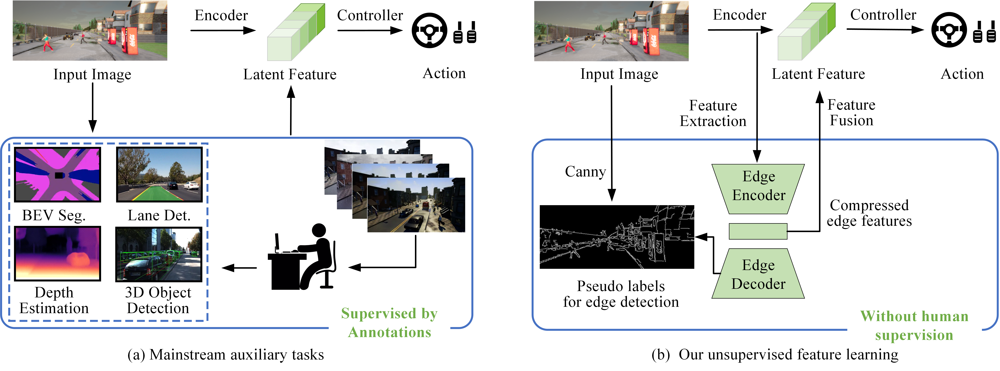
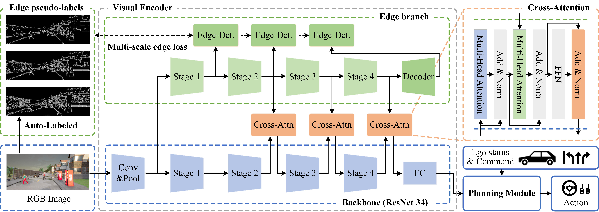
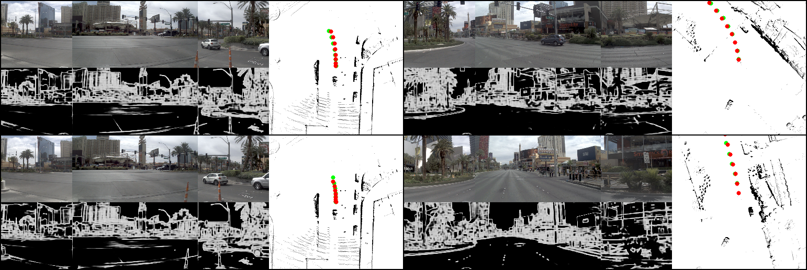

<div align="center">
<h1>UEAD</h1>
<h3>Unsupervised Edge Detection for Enhanced Target Boundary Perception in End-to-End Autonomous Driving</h3>

Runhu Wang<sup>1</sup>, Jie Liu<sup>1</sup>, Fei Ding<sup>1*</sup>, Haiyang Qu<sup>2</sup>
 
<sup>1</sup> The State Key Labora¬tory of Advanced Design and Manufacturing Technology for Vehicle, College of Mechanical and Vehicle Engineering, Hunan University, hangsha 410082, China

<sup>2</sup> The CRRC Zhuzhou Locomotive Co., Ltd., Zhuzhou 412001, China

<sup>*</sup> Corresponding author, dingfei@hnu.edu.cn


</div>

## News
* **` Sep. 9th, 2026`:**  We release the initial version of the UEAD code and model checkpoints for research reproducibility.


## Table of Contents
- [Introduction](#introduction)
- [Results on NAVSIM Navtest Split](#results-on-navsim-navtest)
- [Results on Town05Long benchmark](#results-on-town05long-benchmark)
- [Getting Started](#getting-started)
- [Contact](#contact)
- [Acknowledgement](#acknowledgement)


## Introduction
End-to-end autonomous driving technology can learn driving policies from large-scale driving data. However, most existing end-to-end methods extract driving-critical features from images with designed supervised auxiliary tasks, which naturally require extensive data annotation. This requirement limits the scalability of training data. To address this challenge, novel unsupervised edge detection-based visual feature extraction method is proposed for end-to-end autonomous driving (UEAD) to enhance the perception of driving scene without costly annotations. The proposed UEAD leverages edge pseudo-labels generated by classic edge detection method to improve feature extraction capabilities without additional manual annotations. This approach simplifies the process of expanding the training datasets. Additionally, the extracted edge information is then integrated into the deep features of the encoder so as to provide richer fine-grained spatial information, which finally enhances the perception ability of model to object locations. Extensive experiments on both NAVSIM and CARLA show that the proposed UEAD outperforms traditional approaches supervised by Bird's-Eye-View. Notably, it significantly improves the safety of autonomous driving by reducing the collision rate and the number of infractions.

<div align="center">
<b>Comparison of supervised auxiliary tasks versus our feature learning requiring no manual labeling.</b>

<b>The overall structure of UEAD.</b>

</div>

## Results on NAVSIM Navtest

|     Method     | Params | FPS(RTX4090) | PDMS |  NC  | DAC  | TTC  | Comf. | EP   |
|:--------------:|:------:|:------------:|:----:|:----:|------|------|-------|------|
| Ego Status MLP |   -    |      -       | 65.5 | 93.0 | 77.3 | 83.6 | 100   | 62.8 |
|   TransFuser   |  56M   |     198      | 84.0 | 97.7 | 92.8 | 92.8 | 100   | 79.2 |
|      WoTE      |  70M   |      83      | 87.1 | 98.5 | 95.8 | 94.4 | 99.9  | 80.9 |
|   UEAD(ours)   |  58M   |     102      | 87.1 | 97.7 | 95.7 | 94.4 | 100   | 81.3 |

<div align="center">
<b>Visualization of End-to-End Trajectory Planning and Edge Detection Results.</b>

</div>

## Results on Town05Long benchmark

https://github.com/RunhuWang/UEAD/releases/download/v1.0/output_video_HD.avi
<div align="center">
<b>Qualitative Comparison of CAM Visualizations between UEAD and the Baseline Method in a Pedestrian-Crossing Scenario.</b>

</div>


## Getting Started
### [1. Getting started from NAVSIM environment preparation](https://github.com/autonomousvision/navsim?tab=readme-ov-file#getting-started-)
### 2. Preparation of UEAD environment

Create the UEAD Virtual Environment
```bash
conda activate navsim
```
To accelerate the download process, [Jinkun](https://github.com/Jzzzi)  contributed an improved script, super_download.sh, which uses tmux for parallel downloading.
```bash
cd /path/to/UEAD/download
bash super_download.sh
```

### 3. Cache dataset for faster training and evaluation
```bash
# cache dataset for training
python navsim/planning/script/run_dataset_caching.py agent=uead_agent experiment_name=training_uead_agent train_test_split=navtrain

# cache dataset for evaluation
python navsim/planning/script/run_metric_caching.py train_test_split=navtest cache.cache_path=$NAVSIM_EXP_ROOT/metric_cache
```

### 4. Training

Before training, please download the pretrained ResNet-34 model and modify `bkb_path` in transfuser_config.py under the UEAD agent directory to point to the downloaded weights.
```bash
python $NAVSIM_DEVKIT_ROOT/navsim/planning/script/run_training.py \
        agent=uead_agent \
        experiment_name=training_uead_agent  \
        train_test_split=navtrain  \
        split=trainval   \
        cache_path="${NAVSIM_EXP_ROOT}/training_cache/" \
        use_cache_without_dataset=True  \
        force_cache_computation=False 
```

### 5. Evaluation
You can use the following command to evaluate the trained model `export CKPT=/path/to/your/checkpoint.pth`:
```bash
python $NAVSIM_DEVKIT_ROOT/navsim/planning/script/run_pdm_score.py \
        train_test_split=navtest \
        agent=uead_agent \
        worker=ray_distributed \
        agent.checkpoint_path=$CKPT \
        experiment_name=uead_agent_eval
```

## Contact
If you have any questions, please contact Runhu Wang via email (wz4119@hnu.edu.cn).

## Acknowledgement
UEAD is greatly inspired by the following outstanding contributions to the open-source community: [NAVSIM](https://github.com/autonomousvision/navsim), [Transfuser](https://github.com/autonomousvision/transfuser), [DiffusionDrive](https://github.com/hustvl/DiffusionDrive), [WoTE](https://github.com/liyingyanUCAS/WoTE), [TCP](https://github.com/OpenDriveLab/TCP).

